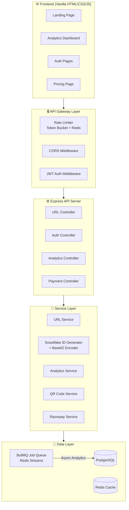

# 🚀 Scalable URL Shortener SaaS — Implementation Plan

## Overview

Build a production-grade, FAANG-interview-ready URL Shortener SaaS platform with:
- **Backend**: Node.js + Express REST API
- **Database**: PostgreSQL (primary) + Redis (cache/queue)
- **Frontend**: Vanilla HTML/CSS/JS with a stunning glassmorphism dark-mode dashboard
- **Payments**: Razorpay (test mode) subscription billing
- **Architecture**: Monolithic but microservices-ready, fully Dockerized

---

## User Review Required

> [!IMPORTANT]
> **Razorpay Keys**: You'll need Razorpay test-mode API keys (`KEY_ID` and `KEY_SECRET`). These will go in the `.env` file. Do you have these already, or should I use placeholder values?

> [!IMPORTANT]
> **Domain / Base URL**: The short URLs will be generated as `http://localhost:3000/abc123` in dev. Do you want a custom domain configured, or is localhost fine for now?

> [!WARNING]
> **Docker Requirement**: Redis and PostgreSQL will run in Docker containers. Ensure Docker Desktop is installed and running on your Mac.

---

## Proposed Architecture



---

## Proposed Changes

### Component 1: Project Foundation & Configuration

Sets up the monorepo structure, Docker services, and environment configuration.

#### [NEW] Project Root Files

| File | Purpose |
|------|---------|
| `package.json` | Dependencies & scripts |
| `.env` | Environment variables (keys, DB URLs) |
| `.env.example` | Template for env vars |
| `docker-compose.yml` | PostgreSQL + Redis containers |
| `Dockerfile` | App containerization |
| `.dockerignore` | Docker ignore rules |
| `.gitignore` | Git ignore rules |

#### Folder Structure
```
url-shortener/
├── docker-compose.yml
├── Dockerfile
├── package.json
├── .env / .env.example
├── src/
│   ├── server.js                    # Entry point
│   ├── app.js                       # Express app setup
│   ├── config/
│   │   ├── database.js              # PostgreSQL (Knex/pg)
│   │   ├── redis.js                 # Redis client (ioredis)
│   │   └── env.js                   # Env validation
│   ├── middleware/
│   │   ├── auth.js                  # JWT verification
│   │   ├── rateLimiter.js           # Token bucket rate limiter
│   │   ├── errorHandler.js          # Central error handling
│   │   └── validator.js             # Request validation
│   ├── routes/
│   │   ├── urlRoutes.js
│   │   ├── authRoutes.js
│   │   ├── analyticsRoutes.js
│   │   └── paymentRoutes.js
│   ├── controllers/
│   │   ├── urlController.js
│   │   ├── authController.js
│   │   ├── analyticsController.js
│   │   └── paymentController.js
│   ├── services/
│   │   ├── urlService.js
│   │   ├── authService.js
│   │   ├── analyticsService.js
│   │   ├── paymentService.js
│   │   └── qrService.js
│   ├── utils/
│   │   ├── snowflake.js             # Snowflake ID generator
│   │   ├── base62.js                # Base62 encoder/decoder
│   │   ├── urlValidator.js          # URL safety checker
│   │   └── blacklist.js             # Domain blacklist
│   ├── db/
│   │   └── migrations/              # Knex migrations
│   │       ├── 001_create_users.js
│   │       ├── 002_create_urls.js
│   │       └── 003_create_analytics.js
│   └── workers/
│       └── analyticsWorker.js       # Async analytics processor
├── public/                          # Frontend
│   ├── index.html                   # Landing page
│   ├── dashboard.html               # Analytics dashboard
│   ├── login.html                   # Login page
│   ├── signup.html                  # Signup page
│   ├── pricing.html                 # Pricing & payments
│   ├── css/
│   │   ├── base.css                 # Design tokens & resets
│   │   ├── landing.css
│   │   ├── dashboard.css
│   │   ├── auth.css
│   │   └── pricing.css
│   └── js/
│       ├── api.js                   # API client
│       ├── auth.js                  # Auth state management
│       ├── dashboard.js             # Dashboard interactivity
│       ├── landing.js               # Landing page logic
│       ├── pricing.js               # Razorpay checkout
│       └── charts.js                # Chart.js analytics
└── tests/                           # (optional, for verification)
```

---

### Component 2: Database Schema & Migrations (PostgreSQL)

#### [NEW] `src/db/migrations/001_create_users.js`
```sql
CREATE TABLE users (
    id              UUID PRIMARY KEY DEFAULT gen_random_uuid(),
    email           VARCHAR(255) UNIQUE NOT NULL,
    password_hash   VARCHAR(255) NOT NULL,
    display_name    VARCHAR(100),
    plan_type       VARCHAR(20) DEFAULT 'free',  -- free | pro | business
    razorpay_sub_id VARCHAR(100),
    links_created   INTEGER DEFAULT 0,
    created_at      TIMESTAMPTZ DEFAULT NOW(),
    updated_at      TIMESTAMPTZ DEFAULT NOW()
);
CREATE INDEX idx_users_email ON users(email);
```

#### [NEW] `src/db/migrations/002_create_urls.js`
```sql
CREATE TABLE urls (
    id              BIGSERIAL PRIMARY KEY,
    short_code      VARCHAR(12) UNIQUE NOT NULL,
    long_url        TEXT NOT NULL,
    user_id         UUID REFERENCES users(id) ON DELETE CASCADE,
    custom_alias    BOOLEAN DEFAULT false,
    password_hash   VARCHAR(255),           -- password-protected links
    expires_at      TIMESTAMPTZ,
    one_time        BOOLEAN DEFAULT false,
    is_active       BOOLEAN DEFAULT true,
    click_count     INTEGER DEFAULT 0,
    created_at      TIMESTAMPTZ DEFAULT NOW(),
    updated_at      TIMESTAMPTZ DEFAULT NOW()
);
CREATE INDEX idx_urls_short_code ON urls(short_code);
CREATE INDEX idx_urls_user_id ON urls(user_id);
CREATE INDEX idx_urls_created_at ON urls(created_at DESC);
```

#### [NEW] `src/db/migrations/003_create_analytics.js`
```sql
CREATE TABLE analytics (
    id              BIGSERIAL PRIMARY KEY,
    url_id          BIGINT REFERENCES urls(id) ON DELETE CASCADE,
    ip_address      INET,
    country         VARCHAR(100),
    city            VARCHAR(100),
    device          VARCHAR(50),
    browser         VARCHAR(50),
    os              VARCHAR(50),
    referer         TEXT,
    created_at      TIMESTAMPTZ DEFAULT NOW()
);
CREATE INDEX idx_analytics_url_id ON analytics(url_id);
CREATE INDEX idx_analytics_created_at ON analytics(created_at DESC);
CREATE INDEX idx_analytics_url_time ON analytics(url_id, created_at DESC);
```

---

### Component 3: Core Backend — ID Generation & URL Service

#### [NEW] `src/utils/snowflake.js`
- Custom Snowflake ID generator using `BigInt`
- 41-bit timestamp + 10-bit machine ID + 12-bit sequence
- Guaranteed unique, no DB coordination needed

#### [NEW] `src/utils/base62.js`
- Encodes Snowflake IDs to short, URL-safe strings
- Charset: `0-9a-zA-Z` (62 chars)
- Typical output: 6-8 characters

#### [NEW] `src/services/urlService.js`
- **`shortenUrl(longUrl, options)`**: Validate → Generate Snowflake ID → Base62 encode → Store in PG → Cache in Redis → Return short URL
- **`resolveUrl(shortCode)`**: Redis lookup → PG fallback → Cache result → Queue analytics event → Return redirect target
- **`updateUrl(id, userId, updates)`**: Update destination URL, expiry, etc.
- **`deleteUrl(id, userId)`**: Soft-delete, invalidate cache
- Custom alias support with collision check

---

### Component 4: Authentication (JWT)

#### [NEW] `src/services/authService.js`
- `bcrypt` password hashing (12 rounds)
- JWT access tokens (15min) + refresh tokens (7d)
- Token stored in `httpOnly` cookies

#### [NEW] `src/middleware/auth.js`
- Extracts JWT from `Authorization: Bearer <token>` header or cookie
- Attaches `req.user` with `{ id, email, plan_type }`
- Optional auth middleware for public endpoints (redirect)

---

### Component 5: Rate Limiting

#### [NEW] `src/middleware/rateLimiter.js`
- **Token Bucket** algorithm backed by Redis
- Tier-based limits:
  | Tier | Shorten | Redirect | Analytics |
  |------|---------|----------|-----------|
  | Free | 10/min | 100/min | 20/min |
  | Pro | 60/min | 1000/min | 100/min |
  | Business | 200/min | 5000/min | 500/min |
  | Unauthenticated | 5/min | 50/min | N/A |
- Per-user (authenticated) + per-IP (unauthenticated)

---

### Component 6: Analytics (Async Processing)

#### [NEW] `src/workers/analyticsWorker.js`
- BullMQ worker consuming from Redis queue
- Parses `User-Agent` for device/browser/OS
- Basic geo-IP lookup (using `geoip-lite` — local DB, no external API)
- Batch-inserts into `analytics` table
- Updates `click_count` in `urls` table

#### [NEW] `src/services/analyticsService.js`
- Time-series aggregations (clicks per hour/day/week)
- Top referrers, devices, countries
- Unique visitor count (distinct IPs)

---

### Component 7: Payment Integration (Razorpay)

#### [NEW] `src/services/paymentService.js`
- Create Razorpay subscription for Pro (₹199/mo) and Business (₹499/mo)
- Handle webhooks: `subscription.activated`, `subscription.charged`, `payment.failed`
- Upgrade/downgrade plan transitions
- Update `users.plan_type` on payment events

#### [NEW] `src/routes/paymentRoutes.js`
- `POST /api/payments/create-subscription` — Creates Razorpay subscription
- `POST /api/payments/webhook` — Handles Razorpay webhook events
- `GET /api/payments/status` — Current subscription status

---

### Component 8: QR Code & Smart Features

#### [NEW] `src/services/qrService.js`
- Generates QR codes using `qrcode` npm package
- Returns Base64 PNG or SVG
- Embedded in dashboard per link

#### URL Validation & Security
- `src/utils/urlValidator.js` — Validates URL format, checks against phishing/malware patterns
- `src/utils/blacklist.js` — Configurable domain blacklist (stores in Redis set)

---

### Component 9: Frontend — Landing Page

#### [NEW] `public/index.html` + `public/css/landing.css` + `public/js/landing.js`

**Design**: Premium dark-mode landing page with:
- **Hero section**: Animated gradient background, glassmorphism URL input card
- **"Shorten Now" CTA**: Works without login (creates anonymous links)
- **Feature cards**: Glassmorphism cards with hover animations
- **Stats counter**: Animated counters (links shortened, clicks tracked, etc.)
- **Pricing preview**: Links to pricing page
- **Footer**: Clean, modern footer

**Typography**: Inter (Google Fonts)
**Color Palette**:
- Background: `#0a0a1a` (deep navy)
- Cards: `rgba(255,255,255,0.05)` with `backdrop-filter: blur(20px)`
- Accent gradient: `#6C63FF → #FF6584` (purple to coral)
- Text: `#E0E0E0` (body), `#FFFFFF` (headings)
- Success: `#00D9A3`, Error: `#FF4757`

---

### Component 10: Frontend — Dashboard

#### [NEW] `public/dashboard.html` + `public/css/dashboard.css` + `public/js/dashboard.js`

**Design**: Full analytics dashboard with:
- **Sidebar**: Glassmorphism nav with icons (links, analytics, settings, pricing)
- **Top bar**: User avatar, plan badge, notifications
- **URL Management**: Table of all links with copy, edit, delete, QR actions
- **Create Modal**: Glassmorphism modal for new link creation (URL, custom alias, expiry, password, one-time toggle)
- **Analytics Panel**: 
  - Line chart (clicks over time) — Chart.js
  - Donut chart (device breakdown)
  - Bar chart (top countries)
  - KPI cards (total clicks, unique visitors, avg daily clicks)
- **Micro-animations**: Counters animate on load, cards slide in, hover glow effects

---

### Component 11: Frontend — Auth & Pricing Pages

#### [NEW] Auth Pages (`login.html`, `signup.html`)
- Centered glassmorphism card design
- Form validation with inline error messages
- "Continue with Google" button (visual only for MVP, Google OAuth requires credentials)

#### [NEW] Pricing Page (`pricing.html`)
- 3-tier pricing cards with glassmorphism effect
- Current plan highlighted
- Razorpay checkout integration for Pro/Business
- Feature comparison table

---

### Component 12: API Documentation (Swagger)

#### [NEW] Swagger/OpenAPI setup
- Using `swagger-jsdoc` + `swagger-ui-express`
- Available at `GET /api-docs`
- Documents all endpoints with request/response schemas

---

## API Design Summary

| Method | Endpoint | Auth | Description |
|--------|----------|------|-------------|
| `POST` | `/api/shorten` | Optional | Shorten a URL |
| `GET` | `/:shortCode` | No | Redirect to long URL |
| `GET` | `/api/links` | Required | List user's links |
| `PUT` | `/api/links/:id` | Required | Update a link |
| `DELETE` | `/api/links/:id` | Required | Delete a link |
| `GET` | `/api/links/:id/qr` | Required | Get QR code |
| `POST` | `/api/auth/signup` | No | Register |
| `POST` | `/api/auth/login` | No | Login |
| `POST` | `/api/auth/refresh` | No | Refresh token |
| `GET` | `/api/analytics/:id` | Required | Link analytics |
| `GET` | `/api/analytics/:id/timeseries` | Required | Time-series data |
| `POST` | `/api/payments/create-subscription` | Required | Start subscription |
| `POST` | `/api/payments/webhook` | No | Razorpay webhook |
| `GET` | `/api/payments/status` | Required | Subscription status |

---

## Open Questions

> [!IMPORTANT]
> 1. **Razorpay API Keys**: Do you have test-mode keys ready, or should I use placeholders for now?
> 2. **Google OAuth**: Do you want this functional (requires Google Cloud Console credentials), or is a visual-only button acceptable for MVP?
> 3. **Deployment Target**: Should I configure for Railway/Render deployment, or is local Docker sufficient for now?
> 4. **Bulk CSV Upload**: Should this be included in MVP, or deferred to a v2 iteration?

---

## Verification Plan

### Automated Tests
1. **Docker services**: `docker-compose up -d` — verify PG and Redis are running
2. **Database migrations**: Run knex migrations and verify schema
3. **API smoke tests**: 
   - `POST /api/auth/signup` → 201
   - `POST /api/auth/login` → 200 + JWT
   - `POST /api/shorten` → 201 + short URL
   - `GET /:shortCode` → 302 redirect
   - `GET /api/analytics/:id` → 200 + click data
4. **Rate limiter**: Hit endpoint beyond limit → verify 429 response
5. **Frontend**: Browser test all pages render correctly

### Manual Verification
- Full user flow walkthrough in browser
- Test Razorpay checkout in test mode
- Verify analytics data after multiple redirects
- Check QR code generation and scanning
- Verify rate limiting behavior per tier
